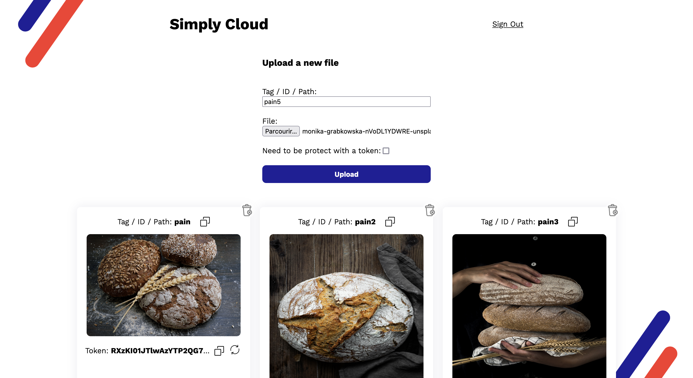
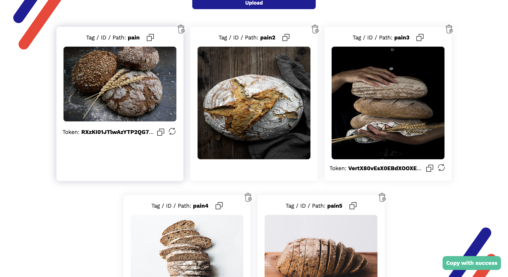

# Ruby On Rails Cloud

This project aim to provide a simple open-source cloud manager (using his own deployments services) able to simply upload file (with an account) and retrieve it without needed to be authentificate (with only a link or tag)



## Purpose

This idea of this repository is to provide a simple cloud who cost ~5$ at month (if you keep the data stores in cloud < 75GB). This cloud can stores any files (and preview some of it). The main purpose of this cloud is to store simple image to use in articles or non-relevant file to be easly shared with other using a simple share link. File can be protect with a token but keep in mind the security issue (see section at the end of this file).



## System Informations:

- Ruby version: 3.1.0
- Rails version: 7.0.3
- System dependencies:
  - macos: imagemagick vips postgresql # For image_processing and db
  - debian/ubuntu: imagemagick libvips postgresql # For image processing and db
- Docker: 20.10.8
- Docker Compose: 1.29.2

## Prerequisite

In order to launch this project, some minor steps need to be run before.

1. Remove the current _config/credentials.yml.enc_ file

```
$ rm config/credentials.yml.enc
```

2. Recreate the _config/credentials.yml.enc_ file

```
$ EDITOR="vim" bin/rails credentials:edit
```

## Startup:

In both startup mode, you need to make the steps from the prerequisite section.

#### Without using Docker:

You can start this projects without using docker. Take a look on System dependencies needed to launch the projet.

1. Install the gem

```
$ bundle install
```

2. Create, migrate, seed the Database

```
$ bin/rails db:create
$ bin/rails db:migrate
$ bin/rails db:seed
```

3. Create an user

```
$ rake user:create_user[<email>, <password>, <password_confirmation>]
```

You need to replace `<email>` with your email, `<password>` and `<password_confirmation>` with a password of you choice. This password should be at least 6 characters and should be the same.

4. Launch the server

```
$ bin/rails s
```

5. Go to a web browser and open [http://localhost:3000](http://localhost:3000)

```
$ firefox http://localhost:3000
```

#### Using Docker:

This project provide a docker-compose.yml useful to simply start the projects.
Using the --profile option of the docker-compose, you can init, migrate and run the rails application.
This docker-compose.yml launch a postgresql database, the rails application and a nginx server (use as a proxy server).

The docker-compose need 3 environments variables and should be provide on start (or directly in the shell):

1. USERID: your user ID
2. GROUPID: your group ID
3. RAILS_MASTER_KEY: the rails master-key

You first need to init the database

1. Init the application and database
   - Launch the container using profile init.
     ```
     $ USERID=$(id -u) GROUPID=$(id -g) RAILS_MASTER_KEY=$(cat config/master.key) docker-compose --profile init up --build -d
     ```
   - Attach to the container and wait until it's over
     ```
     $ docker attach $(docker ps -q -f name="rails-cloud_rails-cloud-db-creator")
     ```
2. Migrate the database
   - Launch the container using profile migrate.
     ```
     $ USERID=$(id -u) GROUPID=$(id -g) RAILS_MASTER_KEY=$(cat config/master.key) docker-compose --profile migrate up -d
     ```
   - Attach to the container and wait until it's over
     ```
     $ docker attach $(docker ps -q -f name="rails-cloud_rails-cloud-migrator")
     ```
3. Launch the application
   - Launch the container using profile run
     ```
     $ USERID=$(id -u) GROUPID=$(id -g) RAILS_MASTER_KEY=$(cat config/master.key) docker-compose --profile run up -d
     ```
4. Create an user
   - Launch the rake task in the containers
     ```
     $ docker exec $(docker ps -q -f name="rails-cloud_rails-cloud") rake "user:create_user[<email>, <password>, <password_confirmation>]"
     ```
     You need to replace `<email>` with your email, `<password>` and `<password_confirmation>` with a password of you choice. This password should be at least 6 characters and should be the same.
5. Go to a web browser and open [http://localhost](http://localhost)

```
$ firefox http://localhost
```

## Deployments:

#### Application:

You can deploy application for free on [heroku](https://www.heroku.com/) or you can use the container to deploy it on a rancher or a manage kubernetes.

#### Buckets:

In order to store and retrieve file, Active Storage use buckets. To keep as low as possible the price of this cloud, I recommend to use the free buckets of [scaleway](https://www.scaleway.com/fr/object-storage/).
You can create an account on the website and follow [this procedure](https://www.scaleway.com/en/docs/storage/object/quickstart/#-Operation-Procedures). You can keep you buckets storage private, it will not impact the way rails serve your files.
After you have created your buckets, you need to generate API-KEY following [this procedure](https://www.scaleway.com/en/docs/console/my-project/how-to/generate-api-key/). Store you key generate since you will need-it.

In order to use your buckets, this cloud use the aws sdk and try to retrieve your informations from the _credentials.yml.enc_. You will need to put configuration value in it.

```
$ EDITOR="vim" bin/rails credentials:edit

# This open the credentials in a vim editor.
# -----------
# Used as the base secret for all MessageVerifiers in Rails, including the one protecting cookies.
secret_key_base: <very_long_random_string>
aws:
  endpoint: <endpoint_of_bucket> # For scaleway it's https://s3.fr-par.scw.cloud
  access_key_id: <access_key> # The first public access_key (generate in API-KEY step)
  secret_access_key: <secret_access_key> # The secret access_key (generate in API-KEY step)
  region: <region> # Depends on the region you choose when creating buckets
  bucket: <bucket_name> # The name of the buckets
```

## Limitation and security issue:

Even if a file is secure with a token, the default access is 5 minutes to a files. This pattern means that if you regenerate a token for a file, a delay of 5 minutes apply in order to make all user use a new token.

Even if a file is secure with a token, nothing can prevent user from downloading it and reshare it after. Use this cloud and share links with only people you can trust.

If a file is not secure with a token, a brute force attack or a dictionnary attack could be realise in order to retrieve all files who are not protect with a token. If you choose to not protect file with a token, you should accept that this file is almost public.

If you found any security issues, you can send it to me or create an [issue](https://github.com/BoutValentin/rails-cloud/issues/new) or directly a [pull request](https://github.com/BoutValentin/rails-cloud/compare) to fix it.

---

## Author:

BOUT Valentin -> bout.valentin@gmail.com
